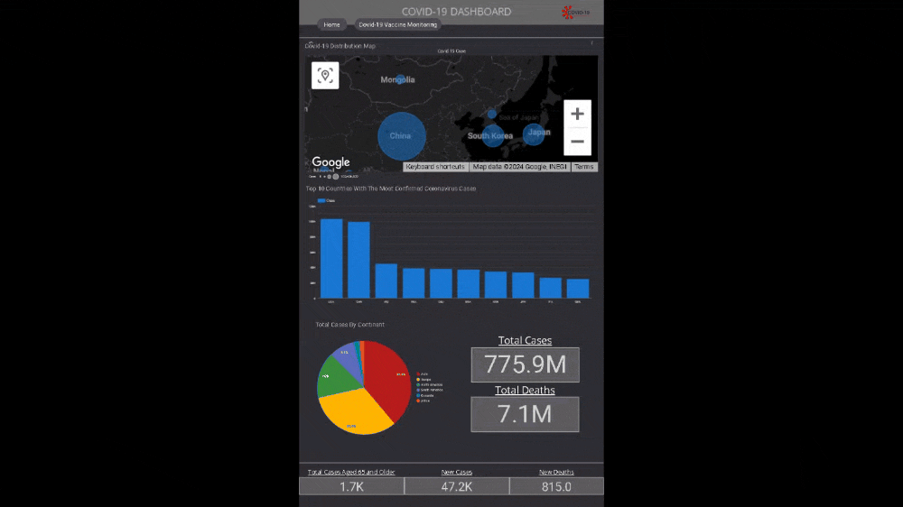

# Dashboard Covid-19

The project involves creating a COVID-19 dashboard using Looker that displays data from various countries, with daily updates facilitated by a Google Sheets script feeding data into BigQuery. Python will be employed to categorize countries based on their COVID-19 death rates, allowing for trend analysis and clustering of fatality rates. The primary aim is to offer an accessible tool for tracking the pandemic and conducting in-depth analyses of fatality rates.

---

## Table of Contents

- [Features](#features)
- [Usage](#Usage)
- [Sources](#Sources)

---

## Features

- **Real-time data viewing**: The dashboard allows users to see real-time data.
- **Country-specific filtering**: Users can select which country's data they want to view.
- **Severity classification results**: Users can view the results of the classification of fatality severity in the selected country.

---

## Usage
- Open the dashboard by navigating to the provided link.
- Use the filters to select the desired country and view real-time data.

---

## Sources

- Link [Dashboard](https://lookerstudio.google.com/u/0/reporting/cfd0450a-491a-440c-8111-806b16044252/page/k0T1D)
- Link [Google Colab](https://colab.research.google.com/drive/1XaKN11FSthJpDIrMjuCSGjlyO4xskufr?usp=sharing)
- Link [Excel](https://colab.research.google.com/drive/1XaKN11FSthJpDIrMjuCSGjlyO4xskufr?usp=sharing)
